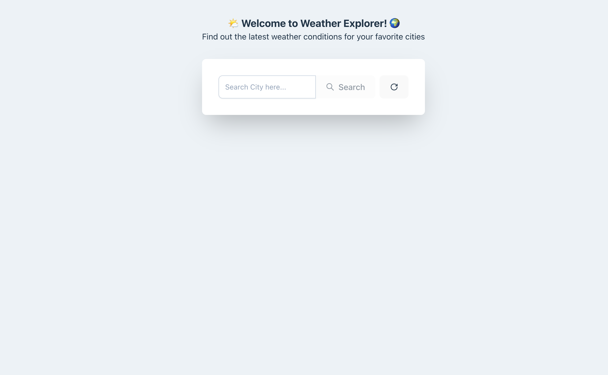

# Weather App 🌦️

A simple and interactive weather app that allows users to check the current weather and forecasts for their favorite cities. It provides temperature, humidity, wind speed.

## Demo 🎬


(https://github.com/user-attachments/assets/a1797763-0f75-4050-b7b1-5895c077f385)

## Features ✨

- **Current Weather**: Display the current temperature, humidity, wind speed.
- **Search Cities**: Type any city to get weather updates.
- **Responsive Layout**: Optimized for desktop and mobile devices.
- **Previous Searches**: Show your previous searches for quick access to their weather.

## Screenshots 📸



## Usage 💡

1. Enter the name of a city into the search bar.

2. Press the "Search" button or hit Enter.

3. The app will fetch and display the current weather for the city.

4. You can clear your previous searches.

5. And you can reset and turn back to the initial state just by clicking the reset button.

## Technologies Used 🛠️

- **React**: The core front-end framework for building the app's user interface.
- **TailwindCSS**: For fast, responsive styling.

### React + TypeScript + Vite

## Setup & Installation 🚀

To run this project locally:

1. **Clone this repository:**

   ```bash
   git clone https://github.com/jayeann/weather-search.git
   ```

2. **Navigate to the project folder:**

   ```bash
   cd weather-search
   ```

3. **Install dependencies:**

   ```bash
   npm install
   ```

4. **Run the app locally:**

   ```bash
   npm start
   ```

   This will start the app in development mode and open it in your browser at http://localhost:5173.


